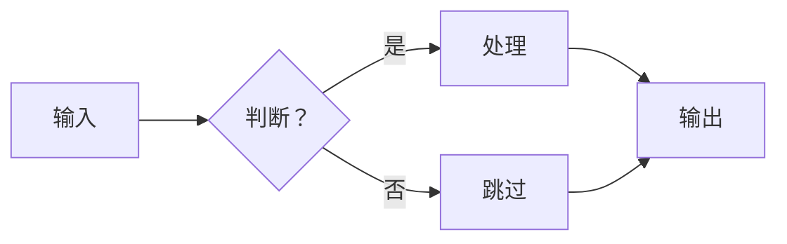
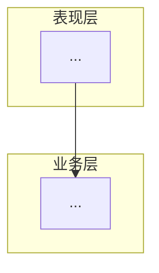
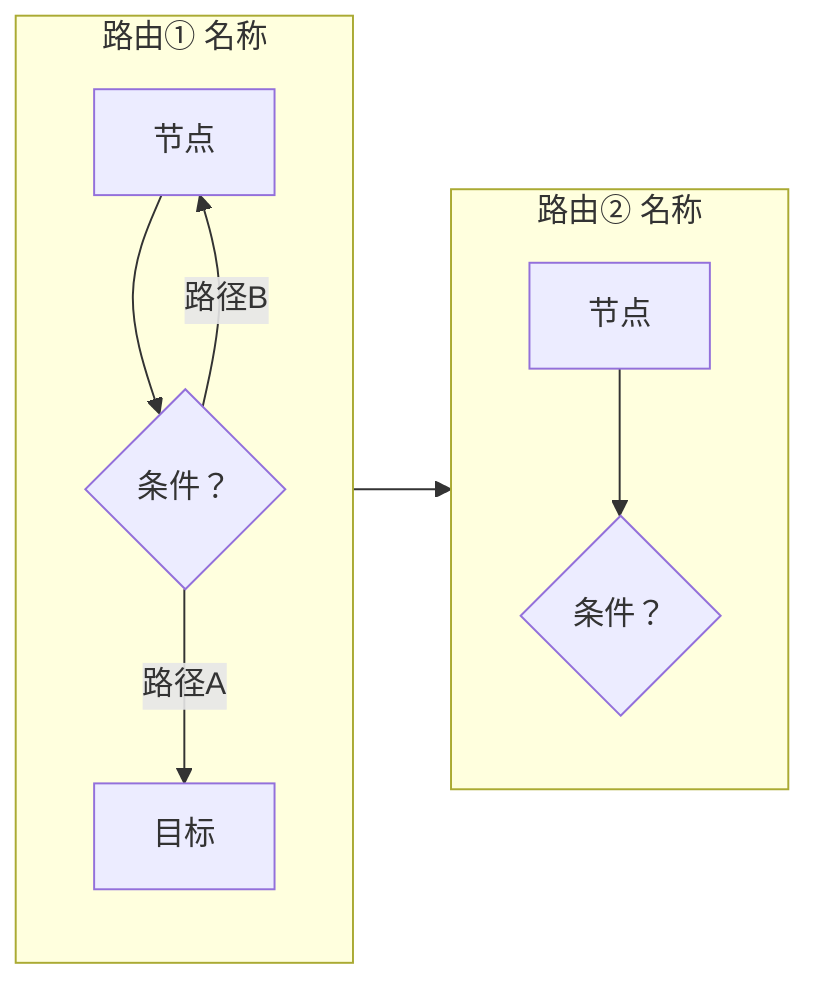

# 项目 README 编写技能（project-readme-authoring）

## 技能定位
本技能用于输出**标准化、专业化、高可读性**的项目 `README.md` 文档，严格遵循 GitHub/Gitee 开源社区通用规范，适配求职面试、开源交付、课程毕设、团队协作等多场景。重点突出项目价值、技术栈、可复现性与技术亮点，可直接用于面试官评审与项目对外交付。

## 适用场景
- 求职面试：个人项目仓库 README 包装，突出个人能力与项目成果
- 开源项目：官方项目说明文档，符合社区通用规范
- 课程/毕设：课程作业、毕业设计项目说明文档
- 团队交付：项目交接文档，保障后续人员可快速上手

## 核心能力
1. **标准结构搭建**：遵循行业通用的 11 模块经典结构，自动生成锚点目录，标题层级严谨，逻辑递进清晰
2. **多类型适配**：支持前后端分离、纯前端、纯后端、算法/大数据、AI/LLM Agent、小程序、毕设等不同项目类型
3. **专业排版美化**：内置技术徽章、Mermaid 流程图、数据表格、居中图文、提示引用块，视觉统一官方
4. **面试向优化**：强制量化测试数据、标注实测/估算、引导提炼技术亮点、规避口语化
5. **可复现保障**：标准化部署启动流程，完整环境版本、依赖安装、配置修改、运行命令

## 工作流程

### 第一步：信息确认
- 确认项目类型（前后端分离/纯前端/纯后端/算法/小程序/毕设/AI Agent 等）
- 确认核心技术栈与对应版本
- 确认使用场景（面试/开源/毕设/团队交付）
- 确认项目核心业务与个人负责模块

**引导式提问**（面试场景必须覆盖）：
- 项目测试覆盖率多少？通过率多少？执行耗时多久？
- 做过性能基准测试吗？有无优化前后数据对比？
- 是否设计了可复用的公共组件/工具库/算法封装？
- 做过哪些安全性加固？具体方案是什么？
- LLM/AI 项目：Token 用量多少？双 LLM 策略节省多少成本？
- 团队协作中你负责了哪些核心模块？主导了哪些技术选型？

### 第二步：模板匹配
根据项目类型与场景，从核心模板库中选择对应基础框架。

### 第三步：内容生成
按模块依次生成完整文档，重点保障：
- **项目简介**：一句话定位 + 业务背景 + 项目规模表格 + 个人职责
- **技术栈**：分层表格，核心技术用 `Vue 3.3` 格式标注版本
- **系统架构**：Mermaid 流程图渲染为 PNG 嵌入，避免依赖 GitHub 渲染
- **部署步骤**：分端编写，命令完整可直接复制执行
- **测试结果**（面试必备）：通过率、覆盖率、执行耗时、每文件用例数表格
- **性能基准**（AI 项目必备）：实测 API 数据 + 节点耗时分布 + Token 用量

### 第四步：排版优化
- 技术徽章（shields.io），包含 Tests/Ruff/CI/License 等
- 表格对齐、代码块标注语言（json/yaml 也需高亮）
- 图片统一存放 `docs/images/`，使用相对路径
- 架构图**直接使用 Mermaid 代码块**（GitHub 原生渲染 + 交互缩放），不要导出 PNG

### 第五步：质量校验
对照质量校验清单逐项检查，输出最终可用的 README。

---

## Mermaid 流程图规范（GitHub 原生渲染）

**核心原则：直接写 Mermaid 代码块，不要导出 PNG。** GitHub 原生渲染 Mermaid，自带交互面板——鼠标滚轮缩放、拖拽画布、全屏预览、右下角导航按钮。PNG 永远没有这些功能。

### 图表类型选择

| 场景 | 类型 | 语法 |
|------|------|------|
| 业务流程、决策树、条件路由 | `flowchart` | 节点 + 箭头 + 决策菱形 `{}` |
| 系统架构分层（分组框） | `graph` | `subgraph` 分组 |
| 时序交互 | `sequenceDiagram` | 参与者 + 消息箭头 |
| 状态机（不推荐，难懂） | `stateDiagram-v2` | 嵌套状态，改为 flowchart 更好 |

### 排版技巧

1. **方向选择**：横向 `LR`（从左到右）比竖向 `TD` 更适合 README，利用页面宽度
2. **决策分支用菱形**：`D{"条件？"}` + 箭头标签 `-->|"是"|`
3. **分组用 subgraph**：把同类节点框在一起，视觉层次清晰
4. **避免嵌套状态图**：`stateDiagram-v2` 的嵌套 state 极难理解，改用 `flowchart` + `subgraph` 平铺
5. **字体勿调**：GitHub 会自动渲染合适的字体大小，不要用 `%%{init}%%` 干预

### 典型模板

**业务流程（横向）：**


**架构分层（分组框）：**


**条件路由（决策树）：**


### 避坑

- ❌ Mermaid 导出 PNG → 没有交互面板，缩放/拖拽全无
- ❌ `stateDiagram-v2` 嵌套状态 → 读者看不懂
- ❌ `flowchart TD` 竖向单列 → README 里看起来又窄又小，改用 `LR`
- ❌ Chrome headless 截图 → 浪费时间，直接 Mermaid 代码块即可
- ✅ 5 张界面截图（真实图片）用 PNG，架构图用 Mermaid，泾渭分明

---

## 核心模板库

### 模板1：前后端分离项目（面试通用版）— 11 模块

```markdown
# 项目名称
> 项目一句话定位：说明业务方向、核心价值、适用用户群体

[](https://vuejs.org/)
[](https://fastapi.tiangolo.com/)
[]()
[]()
[]()

## 目录
1. [项目简介](#1-project-intro)
2. [技术栈](#2-tech-stack)
3. [系统架构](#3-architecture)
4. [核心功能](#4-features)
5. [环境要求](#5-environment)
6. [快速启动](#6-quick-start)
7. [数据集说明](#7-dataset)          <!-- 数据分析/AI 项目专用 -->
8. [技术亮点](#8-highlights)
9. [测试结果](#9-test-results)       <!-- 面试必备 -->
10. [目录结构](#10-structure)
11. [作者信息](#11-author)

---

<h2 id="1-project-intro">1. 项目简介</h2>

### 业务背景
说明项目解决的行业痛点、面向的用户群体、具体业务应用场景。

### 项目规模

| 维度 | 数据 |
|------|------|
| 开发周期 | X 个月（YYYY.MM — YYYY.MM） |
| 代码提交 | N 次 |
| 测试覆盖 | N 个测试用例 |
| 后端模块 | N+ 文件，覆盖 X 个子系统 |
| 个人职责 | 全栈独立开发 / 负责 XX 模块 |

### 效果展示
<div align="center">

<p>系统主界面效果图</p>

<p>系统架构图</p>
</div>

> **提示**：如需在线演示地址或测试账号，请查看仓库 About 或联系作者。

<h2 id="2-tech-stack">2. 技术栈</h2>

### 前端
| 类别 | 技术 | 说明 |
|------|------|------|
| 核心框架 | `Vue 3.3` + `TypeScript` | ... |
| 构建工具 | `Vite 5` | ... |
| UI 组件库 | `Element Plus` | ... |

### 后端
| 类别 | 技术 | 说明 |
|------|------|------|
| 核心框架 | `FastAPI` | ... |
| Agent 框架 | `LangGraph` | ... |
| 数据存储 | `SQLite` | ... |

### LLM（AI Agent 项目专用）
| 类别 | 技术 | 说明 |
|------|------|------|
| 默认模型 | `DeepSeek` | ... |
| 双 LLM 策略 | quick_think / deep_think | ... |
| Embedding | 四级降级 | ... |

<h2 id="3-architecture">3. 系统架构</h2>

### 业务流程

<div align="center">

<p>标题：流程说明</p>
</div>

### 系统架构分层

<div align="center">

<p>标题：分层说明</p>
</div>

### 核心组件说明

| 组件 | 职责 |
|------|------|
| ... | ... |

<h2 id="4-features">4. 核心功能</h2>

- ✅ 功能1：具体说明
- ✅ 功能2：具体说明

<h2 id="5-environment">5. 环境要求</h2>

| 软件 | 版本要求 | 说明 |
|------|----------|------|
| Python | >= 3.10 | 后端运行环境 |
| Node.js | >= 18 | 前端构建环境 |

<h2 id="6-quick-start">6. 快速启动</h2>

### 6.1 环境配置
```bash
git clone <仓库地址>
cd <项目目录>
# 配置 API Key
cp .env.example .env
```

### 6.2 后端启动
```bash
uv venv
uv pip install -e ".[dev]"
python -m uvicorn backend.main:app --host 127.0.0.1 --port 4433 --reload
```

### 6.3 前端启动
```bash
cd frontend && npm install && npm run dev
```

<h2 id="7-dataset">7. 数据集说明</h2>
<!-- 数据分析/AI 项目专用，传统前后端项目可替换为 数据库设计 -->

| 属性 | 值 |
|------|------|
| 文件名 | xxx.csv |
| 行数 × 列数 | N × M |
| 核心字段 | ... |

<h2 id="8-highlights">8. 技术亮点</h2>

**必须量化**，格式：`方案描述 + 前后数据对比`

1. **亮点标题**：做了什么 → 怎么做的 → 效果（从 X 提升到 Y）
2. **亮点标题**：做了什么 → 怎么做的 → 效果（从 X 降低到 Y）

<h2 id="9-test-results">9. 测试结果</h2>

> 面试必备！必须包含：通过率、覆盖率、执行耗时、用例分布

### 后端测试

| 测试文件 | 用例数 | 覆盖内容 |
|----------|:------:|----------|
| `test_xxx.py` | N | 说明 |
| `test_new.py` ★ | N | [新] 说明 |

> ★ 标记为新增专项测试

### 前端测试

| 测试文件 | 用例数 | 覆盖内容 |
|----------|:------:|----------|
| `xxx.test.ts` | N | 说明 |

### 汇总

| 维度 | 数据 |
|------|------|
| 后端测试文件 | N |
| 后端测试用例 | N |
| 前端测试用例 | N |
| **总计** | **N** |
| **通过率** | **XX%** (N passed / N failed / N skipped) |
| **执行耗时** | Xs (无覆盖率) / Xs (含覆盖率) |

### 代码覆盖率

| 核心模块 | 覆盖率 | 说明 |
|----------|:------:|------|
| `module.py` | XX% | ... |
| **总体** | **XX%** | 说明低覆盖率模块的原因 |

### 性能基准 <!-- AI/LLM 项目专用 -->

> Provider: xxx | 场景: "xxx" | 实测/估算需明确标注

**关键指标**（标注 实测/估算）

| 指标 | 数值 | 说明 |
|------|------|------|
| 单次完整分析 | **Xs** (实测) | ... |
| 最慢节点 | xxx (Xs) | 含工具调用 |
| Token 总用量 | ~N (估算) | 需标注估算原因 |

<h2 id="10-structure">10. 目录结构</h2>

```plaintext
项目根目录
├── backend/                 # 后端服务
│   ├── main.py              # 入口
│   ├── agent/               # Agent 实现
│   ├── graph/               # LangGraph 编排
│   ├── tools/               # Agent 工具
│   └── ...
├── frontend/                # 前端页面
├── tests/                   # 测试（N 用例）
├── docs/images/             # 文档配图
└── README.md
```

<h2 id="11-author">11. 作者信息</h2>

- 开发者：XXX
- 邮箱：xxx@xxx.com
- 仓库地址：xxx
```

### 模板2：纯前端项目精简版
适用：Vue/React 前端项目、组件库、静态网站

> **重点调整**：去除后端、数据库、接口相关模块，扩充组件设计思路、打包优化策略、浏览器兼容性、Lighthouse 评分。测试结果聚焦 Vitest/Jest 覆盖率。

### 模板3：AI/Agent/LLM 项目版
适用：LangGraph、LangChain、AutoGPT 等 Agent 项目

> **重点调整**：
> - 技术栈增加 LLM 层（Provider/模型/Embedding/双策略）
> - 架构板块：Agent 协作流程图 + LangGraph 条件路由图
> - 数据集说明替代数据库设计
> - 测试结果增加：幻觉检测、LLM 输出容错、SQL 注入防护、辩论质量
> - **强制添加性能基准**：实测 API 耗时 + Token 用量 + 节点分布
> - **面试问答**：可选附 `doc/interview-qa.md`

### 模板4：算法/数据分析项目版
适用：机器学习、数据分析、深度学习项目

> **重点调整**：替换业务模块为数据集说明、算法原理、评价指标、实验结果对比、复现步骤。

### 模板5：纯后端/API服务项目
适用：RESTful API、微服务、中间件等

> **重点调整**：无前端，侧重接口设计（示例 cURL + JSON）、高并发方案、数据库设计、API 文档链接。

### 模板6：小程序/移动端项目
适用：微信小程序、UniApp、Flutter 等

> **重点调整**：增加 AppID 配置、真机调试、发布流程、包体积优化。

### 模板7：课程/毕设项目
适用：课程设计、毕业设计项目

> **重点调整**：突出学习成果、设计思路、答辩要点。个人职责写"在导师指导下完成"。

---

## 量化数据权威等级

面试官对不同来源数据的采信度不同，必须明确标注：

| 等级 | 标注 | 含义 | 示例 |
|:----:|------|------|------|
| 🥇 | **实测** | 跑完拿到的数据 | 单次分析 116.5s（DeepSeek API 实测） |
| 🥈 | **测试验证** | 单元测试覆盖的行为 | TokenTracker 5线程×100次，零竞态 |
| 🥉 | **估算** | 基于经验/公式推算 | Token ~24,860（Prompt 模板+平均响应长度） |
| ❌ | 无标注 | 面试官默认为编造 | — |

**绝对不要**：把估算数据当实测数据写。如果 TokenTracker 没接入回调链，就明确写"标注为估算，待接入 LiteLLM callback 后精确追踪"——这反而体现工程诚实度。

---

## 质量校验清单

- ✅ **结构规范**：标题层级无跳级，一级标题仅1个，目录锚点可正常跳转（HTML 锚点）
- ✅ **核心完整**：项目简介、技术栈、架构图、启动步骤、测试结果、技术亮点六大模块
- ✅ **量化有据**：测试数据标注 实测/估算，性能基准来自真实运行或标注估算
- ✅ **排版统一**：代码块标注语言，表格对齐，分割线分隔大模块
- ✅ **面试适配**：有量化成果数据，个人职责明确，数据来源可追溯
- ✅ **可复现**：部署步骤完整，依赖版本明确，启动命令可直接复制执行
- ✅ **术语统一**：技术名词大小写规范（`Vue 3.3`、`FastAPI`），无前后矛盾
- ✅ **图片安全**：相对路径在项目内，架构图建议 Mermaid→PNG 而非依赖 GitHub 渲染
- ✅ **诚实标注**：估算数据明确说"估算"，未完成功能说明原因

---

## 进阶优化技巧
1. **技术徽章**：[shields.io](https://shields.io)，Tests/CI/License 必备，链接指向仓库
2. **架构图**：Mermaid 写 → HTML+CDN 渲染 → Chrome headless 截图 PNG，保留生成脚本
3. **配图规范**：首页 1-2 张核心截图 + 1-2 张架构流程图，全部 `docs/images/` 相对路径
4. **测试结果表**：每文件一行，新增文件用 ★ 标记，面试时展示"我加了哪些专项测试"
5. **性能基准**：写 benchmark 脚本跑一次真实 API，保存 `docs/benchmark_result.json`
6. **在线演示**：有部署环境提供地址和测试账号
7. **面试问答**：大型项目独立 `doc/interview-qa.md`，README 末尾链接

---

## 避坑红线
- ❌ 大段纯文字无分层、无目录、无标题
- ❌ 只罗列业务功能，无技术亮点与优化思考
- ❌ 口语化表述（"随便写的""很好用""踩了很多坑"）
- ❌ 缺失完整启动步骤（命令混入无关文字、代码块未闭合）
- ❌ 图片使用绝对路径或外链
- ❌ **夸大成果但无数据支撑**（最致命！面试官可能当场验证）
- ❌ **估算数据不标注**（被追问时露馅比诚实标注差得多）
- ❌ 锚点因中文编码失效
- ❌ **架构图只放 Mermaid 代码块**（GitHub 可能不渲染，建议渲染为 PNG 嵌入）
- ❌ 测试结果只有总数，没有通过率和覆盖率
