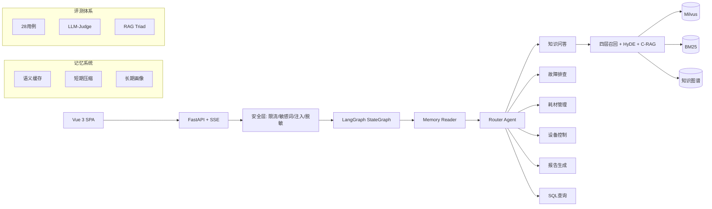

# Smart QA Agent — 基于 LangGraph 的多 Agent 智能问答系统

> 智能家居客服场景的多 Agent 问答系统。支持知识问答、故障排查、耗材管理、设备控制、报告生成、Text2SQL 六大业务场景。
>
> 后端 FastAPI + LangGraph + Milvus + PostgreSQL，前端 Vue 3 (taste-skill 设计系统) + Tailwind CSS。

## 架构



## 六大业务场景

| 场景 | 示例查询 | 核心技术 |
|------|---------|---------|
| **知识问答** | "X30 Pro 吸力多大"、"怎么配网" | C-RAG + HyDE + Multi-Query + GraphRAG |
| **故障排查** | "显示E05不走了"、"回充找不到充电座" | 15类决策树 + 多轮诊断 + 错误码速查 |
| **耗材管理** | "边刷该换什么型号"、"滤网多少钱" | 兼容表 + 同义词映射 + HITL下单 |
| **设备控制** | "开始清扫"、"回去充电" | Function Calling + 6种命令 |
| **报告生成** | "本月使用报告" | Text2SQL + 使用统计 |
| **通用对话** | "你好"、"今天天气怎么样" | 寒暄/越界分层响应 |

## 快速开始

```bash
# 1. 安装依赖
make install

# 2. 配置环境变量
cp .env.example .env
# 编辑 .env: 必填 LLM_API_KEY + LLM_BASE_URL

# 3. 启动基础设施 (Docker)
make docker-up-infra

# 4. 初始化数据库 + 向量库
make db-init && make db-migrate && make vector-init

# 5. 启动后端
make dev                    # http://localhost:8000

# 6. 启动前端 (另开终端)
cd frontend && npm install && npm run dev  # http://localhost:5173
```

## API 端点

| 方法 | 路径 | 说明 |
|------|------|------|
| `POST` | `/api/v1/chat` | 非流式对话 |
| `POST` | `/api/v1/chat/stream` | SSE 流式对话 |
| `GET` | `/api/v1/session/{id}/history` | 对话历史 |
| `POST` | `/api/v1/knowledge/upload` | 上传知识文档 |
| `GET` | `/api/v1/knowledge/status` | 知识库状态 |
| `GET` | `/health` | 健康检查 |

## 评测

```bash
# 全部 28 条用例 (关键词模式)
make eval

# 仅简单难度 + LLM Judge 打分
uv run python -m smart_qa.evaluation.runner --difficulty easy --judge-llm
```

| 指标 | 修复前 | 修复后 |
|------|--------|--------|
| 通过率 | 63.89% | **93.75%** |
| 意图准确率 | 75.00% | **93.75%** |
| 平均延迟 | 54.91s | **24.47s** |
| RAG Triad 综合 | — | **0.86** |
| 忠实度 | 0.56 | **0.80** |

## 项目结构

```
├── src/smart_qa/         # 后端 (~70 .py 文件)
│   ├── agent/            # LangGraph 编排 + Agent + Guard
│   ├── api/              # FastAPI 路由 + SSE
│   ├── scenarios/        # 6大业务场景
│   ├── rag/              # 检索增强 (四层召回/HyDE/Citation/Reranker)
│   ├── knowledge/        # BM25/Milvus/Embedding/知识图谱
│   ├── memory/           # 语义缓存/短期压缩/对话持久化
│   ├── evaluation/       # 28用例 + LLM-Judge + RAG Triad
│   ├── security/         # 限流/敏感词/注入检测/PII脱敏
│   └── observability/    # OTel + Prometheus + Loguru
├── frontend/             # Vue 3 + taste-skill 设计系统
├── tests/                # 21 测试文件 (232 条用例)
├── alembic/              # 数据库迁移
├── deploy/               # Docker Compose + Dockerfile
├── data/                 # 知识文档 (7类16文件)
└── docs/                 # 技术文档
```

## 文档

- [技术架构](docs/ARCHITECTURE.md) — 系统架构 + 模块清单 + 设计决策
- [开发指南](docs/DEVELOPMENT.md) — 项目结构 + 常用命令 + 调试
- [部署指南](docs/DEPLOYMENT.md) — Docker Compose / 手动 / Windows
- [API 文档](docs/API.md) — 接口说明

## 技术栈

| 层级 | 技术 |
|------|------|
| Agent 框架 | LangGraph StateGraph (9节点, MemorySaver, PostgresStore) |
| Web 框架 | FastAPI + SSE 流式 |
| 向量库 | Milvus 2.5.6 (123 chunks) |
| 数据库 | PostgreSQL 17 + Alembic |
| 缓存 | Redis 7 (语义缓存 + 限流) |
| 重排序 | BGE-Reranker-v2-m3 Cross-Encoder |
| 嵌入 | DashScope text-embedding-v4 (API) |
| 前端 | Vue 3 + Vite + Tailwind (taste-skill 设计) |
| 可观测 | OpenTelemetry + Prometheus + SigNoz |
| 包管理 | uv (清华镜像) |
