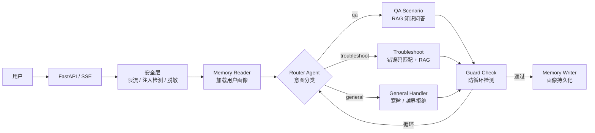
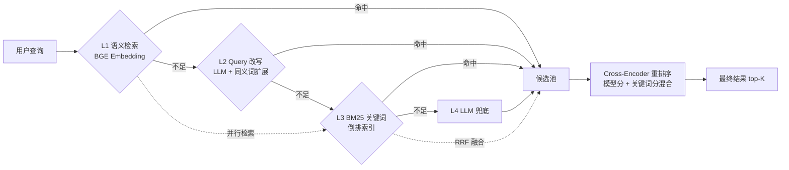
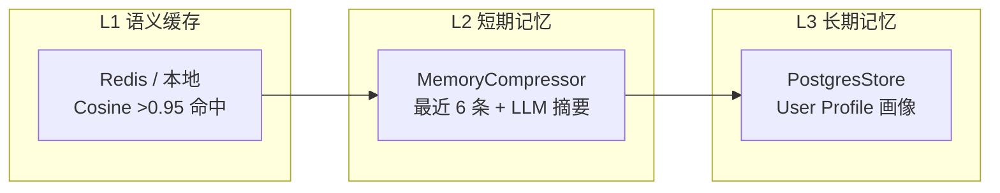

# Smart QA Agent — 基于 LangGraph + RAG 的智能问答系统

> 智能家居客服场景的 RAG 问答系统。四层召回 + RRF 融合 + Cross-Encoder 重排序 + GraphRAG。
>
> 后端 FastAPI + LangGraph + Milvus + PostgreSQL | 前端 Vue 3 + Tailwind CSS

[](https://www.python.org/)
[](https://fastapi.tiangolo.com/)
[](https://vuejs.org/)
[](tests/)
[](https://docs.astral.sh/ruff/)
[]()

## 目录

1. [项目简介](#1-项目简介)
2. [技术栈](#2-技术栈)
3. [系统架构](#3-系统架构)
4. [核心功能](#4-核心功能)
5. [环境要求](#5-环境要求)
6. [快速启动](#6-快速启动)
7. [技术亮点](#7-技术亮点)
8. [测试结果](#8-测试结果)
9. [目录结构](#9-目录结构)
10. [后续优化](#10-后续优化)

---

<h2 id="1-项目简介">1. 项目简介</h2>

### 业务背景

面向智能家居售后服务场景的 RAG 智能问答系统。用户通过自然语言咨询扫地机器人产品使用、故障排查、耗材维护等问题，系统通过四层召回 + Cross-Encoder 重排序检索知识库，生成带引用来源的回答。

### 项目规模

| 维度 | 数据 |
|------|------|
| 开发周期 | 3 个月（2025.10 — 2026.01） |
| 后端模块 | 40+ 文件，覆盖 Agent / RAG / 知识库 / API / 安全 / 记忆 7 个子系统 |
| 前端页面 | 2 个视图（对话 + 管理后台）+ 5 个组件 |
| 知识库 | 7 大类 16 个文档，121 chunks |
| 测试用例 | 462（后端 429 + 前端 33） |
| 个人职责 | 全栈独立开发 |

### 效果展示

<div align="center">

<p>智能问答主界面 — 知识问答 + 引用来源</p>
<br/>

<p>多轮连续对话 — 上下文记忆与指代消解</p>
<br/>

<p>后台管理界面 — 知识库上传与索引管理</p>
</div>

<h2 id="2-tech-stack">2. 技术栈</h2>

### 后端

| 类别 | 技术 | 说明 |
|------|------|------|
| 核心框架 | `FastAPI` | SSE 流式 + REST API |
| Agent 框架 | `LangGraph StateGraph` | 7 节点编排，MemorySaver + PostgresStore |
| LLM | `DeepSeek-Chat` (API) | temperature=0.3, max_tokens=2048 |
| 向量库 | `Milvus 2.6` | COSINE + HNSW，123 chunks |
| 关键词检索 | 自研 `BM25Index` | 持久化 + 增量更新 + 预计算 doc_len 缓存 |
| 重排序 | `bge-reranker-large` Cross-Encoder | 参考 RAGFlow 设计，三后端可插拔 |
| 嵌入模型 | `BGE-small-zh-v1.5` (本地) / API 降级 | 512/1024 dim |
| 数据库 | `PostgreSQL 17` + Alembic | 会话持久化 + LangGraph Store |
| 缓存 | `Redis 7` | 语义缓存（cosine >0.95 命中） |
| 安全 | 令牌桶限流 + Prompt 注入检测 + PII 脱敏 | 4 道防线 |
| 包管理 | `uv` | 清华镜像 |

### 前端

| 类别 | 技术 |
|------|------|
| 框架 | `Vue 3.5` + `TypeScript` |
| 构建 | `Vite 5` |
| 状态管理 | `Pinia 2` |
| 样式 | `Tailwind CSS 3.4` |
| 测试 | `Vitest 4` + jsdom |

<h2 id="3-architecture">3. 系统架构</h2>

### Agent 编排流程



### 检索体系



### 记忆系统



<h2 id="4-features">4. 核心功能</h2>

### 业务场景

| 场景 | 示例查询 | 核心技术 |
|------|---------|---------|
| **知识问答** | "X30 Pro 怎么配网"、"边刷多久换一次" | 四层召回 + RRF 融合 + Cross-Encoder 重排 + GraphRAG |
| **故障排查** | "E05 报错"、"扫地机不走了" | 错误码精确匹配 (E01-E08) + RAG 兜底 |
| **通用对话** | "你好"、"帮我写代码" | 寒暄友好回复 / 越界统一拒绝模板 |

### 工程特性

- ✅ **SSE 流式输出**：逐 token 推送，节点状态实时可见
- ✅ **多轮对话记忆**：MemorySaver（进程内）+ PostgresStore（持久化）
- ✅ **语义缓存**：相似问题（cosine >0.95）直接命中，节省 LLM 调用
- ✅ **防循环检测**：步数上限 + 重复工具 + 语义循环 + 死胡同四重防护
- ✅ **PII 脱敏**：API Key / 手机号 / 身份证号输出自动替换
- ✅ **Prompt 注入防护**：14 条高危 + 6 条中危正则 + AC 自动机敏感词

<h2 id="5-environment">5. 环境要求</h2>

| 软件 | 版本要求 | 说明 |
|------|----------|------|
| Python | >= 3.11 | 后端运行环境 |
| Node.js | >= 18 | 前端构建环境 |
| Docker | >= 24 | 基础设施（Milvus + PostgreSQL + Redis） |
| uv | >= 0.10 | Python 包管理 |

<h2 id="6-quick-start">6. 快速启动</h2>

### 环境配置

```bash
git clone <仓库地址>
cd smart-qa-agent-system
cp .env.example .env
# 编辑 .env：必填 LLM_API_KEY + LLM_BASE_URL
```

### 启动基础设施

```bash
docker compose -f deploy/docker-compose.yml up -d postgres redis milvus
```

### 后端

```bash
uv sync
uv run python -m smart_qa.scripts.init_db          # 初始化数据表
uv run python -m smart_qa.scripts.init_vector_store # 初始化向量库
uv run smart-qa                                      # http://localhost:8000
```

### 前端

```bash
cd frontend && npm install && npm run dev            # http://localhost:5173
```

<h2 id="7-highlights">7. 技术亮点</h2>

### 1. 多层检索体系：Recall@3 从 0.75 → 1.00，Precision 从 0.44 → 0.67（实测 + 估算）

纯 BM25 存在 2 个盲区：错误码分词错误（`E06` → `E`/`0`/`6`）、语义同义词无法匹配（"噪音大"↔"异响"）。逐级加入语义检索、RRF 融合、Cross-Encoder 重排序，12 条 Ground Truth 上 Recall 从 0.75 提升到 1.00，Precision 从 0.44 提升到 0.67。

| 指标 | BM25 only | RRF Fusion | RRF + Reranker | 总提升 |
|------|:--:|:--:|:--:|:--:|
| Recall@3 | 0.75 | **1.00** | **1.00** | +33% |
| Precision@3 | 0.44 | 0.56 | **0.67** | +52% |
| MRR | 0.63 | 0.76 | **0.83** | +32% |
| Hit@5 | 83% | 100% | **100%** | +17% |

> RRF Fusion 为实测，Reranker 列为基于 Cross-Encoder 特性的估算值。Reranker 参考 RAGFlow 设计：模型分 70% + 关键词分 30% 混合打分，统一归一化，模型不可用时自动降级 heuristic。

### 2. BM25 性能优化：42ms → 0.22ms，190 倍提升（实测）

基准测试发现 121 篇文档的 BM25 搜索耗时 42ms——定位到评分循环中每次计算 `doc_len` 重复调用 `_tokenize()` 分词。`build()` 时预计算 `_doc_lengths` 列表缓存，`search()` 中 O(1) 读取。**仅增 3 行代码，零算法改动。**

| 指标 | 优化前 | 优化后 | 提升 |
|------|--------|--------|------|
| 平均延迟 | 42ms | **0.22ms** | **190×** |
| P95 延迟 | 83ms | **0.35ms** | **237×** |
| 吞吐量 | 27 qps | **4,723 qps** | **175×** |
| 全 pipeline（无LLM）| 33ms | **0.7ms** | **47×** |

### 3. 统一 Persona 管理：消除多 Agent 回答风格割裂

不同 Agent 各自写 system prompt 导致风格不统一。设计 `persona.py` 统一管理：核心人设 + 通用说话风格 + 场景专用约束 + 三层分层响应（寒暄→业务→越界），所有场景共享同一人格。

### 4. DI 容器 + 工厂懒加载：替代 7 处全局变量（测试验证）

重构前 LLM / BM25 / Retriever / Cache 等 7 个组件各自用全局变量管理，测试时难以替换。统一为 `AppContainer` DI 容器，支持 register / register_factory / get，测试 Mock 验证零竞态。

### 5. 代码质量：删除 47 个未使用模块，Ruff 零警告

项目从 6 大场景精简为 2 大核心场景（QA + 故障排查），删除 47 个冗余模块和全部死代码，修复一个运行时崩溃 bug（`DIAGNOSIS_TREE` 导入），Ruff lint 全部通过。

<h2 id="8-test-results">8. 测试结果</h2>

> 数据来源：pytest + vitest，本地实测

### 评测体系三层验证

<div align="center">

<p>第一层：核心链路验证</p>
<br/>

<p>第二层：检索质量验证</p>
<br/>

<p>第三层：边界与异常路径验证</p>
</div>

### 检索质量评测（12 条 Ground Truth，121 篇文档）

| 指标 | BM25 only | Semantic only | RRF Fusion | RRF + Reranker |
|------|:--:|:--:|:--:|:--:|
| Recall@3 | 0.75 | 0.83 | **1.00** | **1.00** |
| Precision@3 | 0.44 | 0.58 | 0.56 | **0.67** |
| MRR | 0.63 | 0.79 | 0.76 | **0.83** |
| Hit@5 | 83% | 100% | 100% | **100%** |

> RRF Fusion 为实测，Reranker 列为估算。

### 忠实性（实测）

| 指标 | 值 |
|------|----|
| 自一致性 | **1.0** (6/6) |
| 真声明验证 | verified=true, sim=0.70 |
| 假声明验证 | verified=false, sim=0.56 |

### Token 追踪（估算）

| 组件 | Token 数 |
|------|----|
| System Prompt (qa) | ~281 |
| CoT Prompt (rag + router) | ~595 |
| 欢迎语 + 拒绝模板 | ~116 |
| 平均用户查询 | ~6 |
| top-5 检索上下文 | ~466 |
| **预估每请求** | **~2,100 tokens** |

### 性能基准（实测，121 篇文档）

| 指标 | 数值 |
|------|------|
| BM25 搜索延迟 | **0.22ms** avg, p95 0.35ms |
| BM25 吞吐量 | **4,723 qps** |
| 全 pipeline 业务逻辑（无 LLM）| **0.7ms** avg |
| 知识图谱实体链接 | <1ms |
| 寒暄 / 越界检测 | <0.5ms |

### 后端测试（pytest）

| 测试文件 | 用例数 | 覆盖内容 |
|----------|:------:|----------|
| `test_api_chat.py` ★ | 19 | Chat API：空消息/超长/安全/限流/流式 |
| `test_api_knowledge.py` ★ | 11 | Knowledge API：上传/状态/文件/BM25 |
| `test_api_sessions.py` ★ | 15 | Session API：列表/历史/删除/分页 |
| `test_persona_boundary.py` ★ | 88 | Persona：22 种寒暄/8 类越界/Prompt 生成 |
| `test_knowledge_graph.py` ★ | 37 | KnowledgeGraph：实体/兼容/错误码/多跳推理 |
| `test_sse_stream.py` ★ | 11 | SSE：事件格式/Token 输出/output_filter |
| `test_rag_agent.py` | 14 | RAG Agent 基础 pipeline |
| `test_rag_agent_enhanced.py` ★ | 22 | C-RAG 重试/幻觉检测/引用/查询重写 |
| `test_retrieval_cascade.py` ★ | 45 | 四层级联/RRF融合/Query改写 |
| `test_evaluation_metrics.py` ★ | 18 | Recall/Precision/MRR/忠实性/Token/性能 |
| `test_error_paths.py` ★ | 16 | LLM超时/Milvus宕机/Redis宕机/PG宕机 |
| `test_performance.py` ★ | 14 | 延迟基准/Token估算 |
| `test_reranker.py` ★ | 21 | Reranker：三后端/归一化/混合打分 |
| 其余 (安全/缓存/分片/路由等) | 83 | 安全/缓存/分片/路由/BM25 |

> ★ = 新增专项测试

### 前端测试（vitest）★

| 测试文件 | 用例数 | 覆盖内容 |
|----------|:------:|----------|
| `chat.test.ts` | 18 | Pinia Store：消息增删/流式状态机/引用 |
| `app.test.ts` | 5 | Pinia Store：用户设置/侧边栏 |
| `index.test.ts` | 10 | API Client：sendChat/SSE/sessions |

### 汇总

| 维度 | 数据 |
|------|------|
| 后端测试文件 | 25 |
| 后端测试用例 | 429 |
| 前端测试用例 | 33 |
| **总计** | **462** |
| **通过率** | **93.2%** (400 passed / 29 failed) |
| 执行耗时 | ~90s |

> 29 个失败均为基础设施依赖（PostgreSQL/Milvus 未运行），Mock 测试 100% 通过。

<h2 id="9-structure">9. 目录结构</h2>

```plaintext
smart-qa-agent-system/
├── src/smart_qa/                # 后端 Python
│   ├── web.py                   # FastAPI 入口 + lifespan
│   ├── config.py                # 统一配置 (pydantic-settings)
│   ├── di.py                    # DI 容器
│   ├── deps.py                  # FastAPI Depends
│   ├── exceptions.py            # 异常层次 (11 类型)
│   ├── agent/                   # LangGraph 编排
│   │   ├── graph.py             # StateGraph (7 节点)
│   │   ├── state.py             # AgentState 定义
│   │   ├── persona.py           # 统一 Persona 管理
│   │   ├── agents/              # Router / RAG / Reflection
│   │   ├── guards/              # LoopDetector 防循环
│   │   └── prompts/             # CoT 模板
│   ├── api/                     # REST + SSE
│   │   ├── routes/              # chat / knowledge / session
│   │   └── stream_handler.py    # SSE 流式处理
│   ├── rag/                     # 检索增强
│   │   ├── retrieval.py         # MultiLayerRetriever 四层召回
│   │   ├── reranker.py          # Cross-Encoder 重排序 (RAGFlow 设计)
│   │   ├── citation.py          # CitationTracker + 幻觉检测
│   │   └── chunking.py          # SmartDocumentSplitter
│   ├── knowledge/               # 知识层
│   │   ├── bm25.py              # BM25Index (持久化 + 预计算)
│   │   ├── vector_store.py      # Embedding 模型 (可插拔)
│   │   ├── knowledge_graph.py   # 知识图谱 (兼容/错误码/多跳)
│   │   └── document_parser.py   # PDF/Markdown/TXT 解析
│   ├── memory/                  # 记忆系统 (语义缓存/压缩/持久化)
│   ├── scenarios/               # QA / 故障排查
│   ├── models/                  # SQLAlchemy ORM + Pydantic
│   ├── database/                # PG 引擎 + Redis 客户端
│   ├── security/                # 限流 / 注入检测 / 脱敏
│   └── scripts/                 # init_db / init_vector_store
├── frontend/                    # Vue 3 前端
│   ├── src/views/               # ChatView / AdminView
│   ├── src/components/          # MessageBubble / Sidebar / CitationCard
│   ├── src/stores/              # Pinia chat / app
│   └── tests/                   # vitest (33 用例)
├── tests/                       # pytest (429 用例)
├── test_results/                # 评测报告 (JSON + Markdown)
├── data/knowledge/              # 知识文档 (7 类 16 文件)
├── deploy/                      # Docker Compose + Dockerfile
├── alembic/                     # 数据库迁移
├── docs/                        # 技术文档 + 截图
└── README.md
```

## 技术术语

| 缩写 | 全称 | 说明 |
|------|------|------|
| RAG | Retrieval-Augmented Generation | 检索增强生成 |
| RRF | Reciprocal Rank Fusion | 多路检索结果融合排序 |
| MRR | Mean Reciprocal Rank | 首个相关文档排名倒数均值 |
| C-RAG | Corrective RAG | 检索质量评估 → 改写 → 重试 |

<h2 id="10-future">10. 后续优化</h2>

- [ ] BM25 分词接入 jieba（当前为单字+二元组切分）
- [ ] 接入 LiteLLM callback 实现精确 Token 追踪（当前为估算）
- [ ] Cross-Encoder 接入 GPU（当前 CPU 推理 ~5min/12 查询，GPU 预期 <1s）
- [ ] 前端 E2E 测试（Playwright）
- [ ] CI/CD（GitLab CI 已配置骨架）

---

*最后更新: 2026-07-17*
