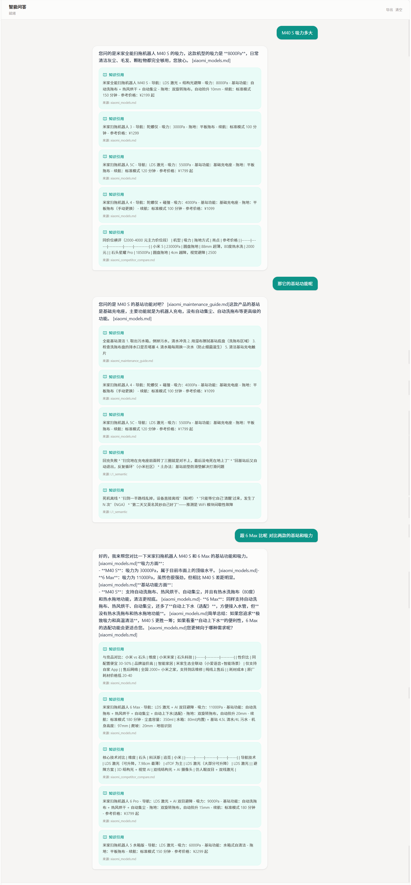
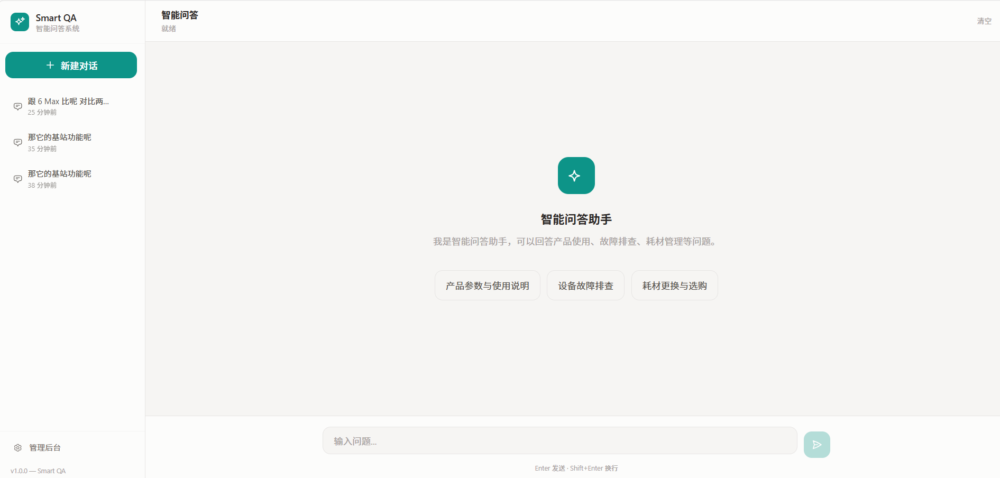
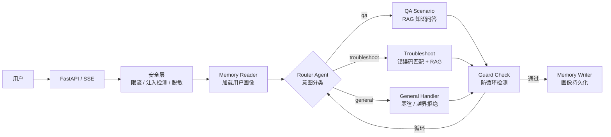
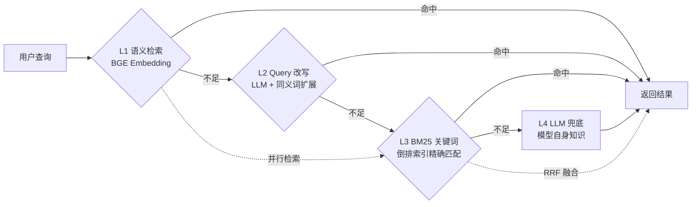
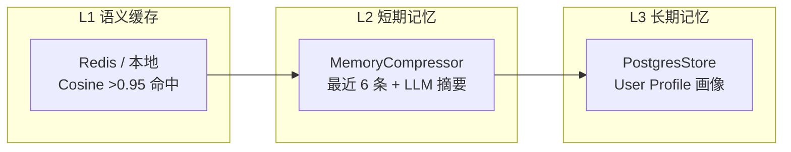
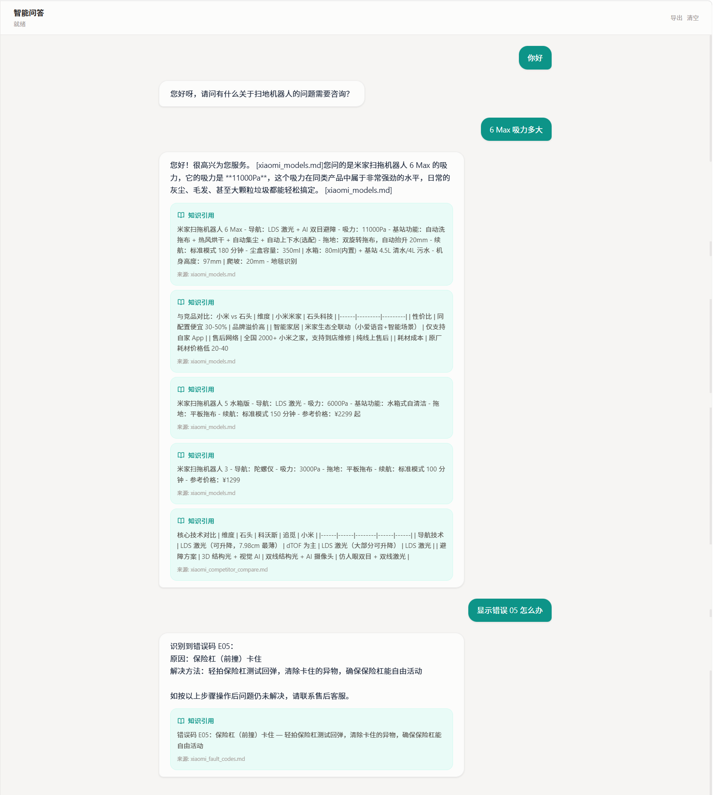
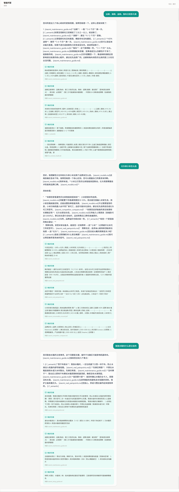
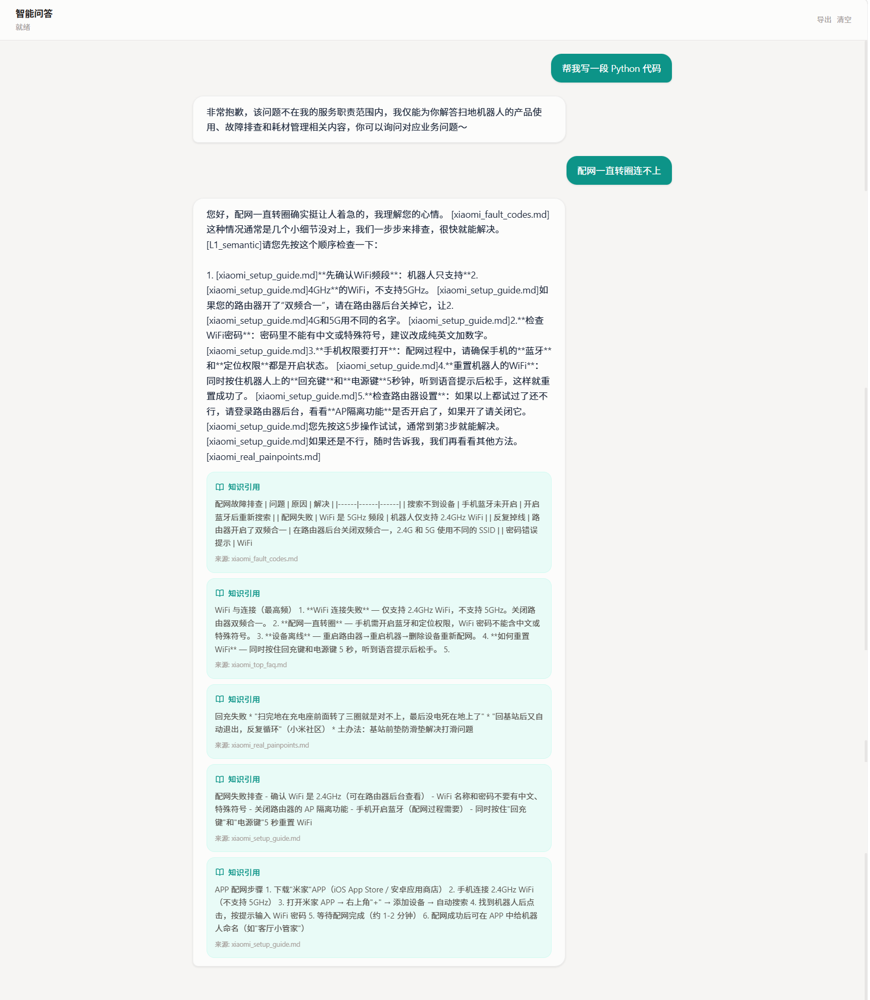

# Smart QA Agent — 基于 LangGraph 的多 Agent 智能问答系统

> 智能家居客服场景的多 Agent 问答系统，专注扫地机器人产品线。支持知识问答与故障排查两大场景，四层召回兜底 + RRF 融合 + GraphRAG。
>
> 后端 FastAPI + LangGraph + Milvus + PostgreSQL | 前端 Vue 3 + Tailwind CSS

[](https://www.python.org/)
[](https://fastapi.tiangolo.com/)
[](https://vuejs.org/)
[](tests/)
[](https://docs.astral.sh/ruff/)
[]()

## 目录

1. [项目简介](#1-项目简介)
2. [技术栈](#2-技术栈)
3. [系统架构](#3-系统架构)
4. [核心功能](#4-核心功能)
5. [环境要求](#5-环境要求)
6. [快速启动](#6-快速启动)
7. [技术亮点](#7-技术亮点)
8. [评测结果](#8-评测结果)
9. [目录结构](#9-目录结构)

---

<h2 id="1-项目简介">1. 项目简介</h2>

### 业务背景

面向智能家居售后服务场景，构建支持多轮对话的智能问答系统。用户可通过自然语言咨询扫地机器人的产品使用、故障排查、耗材维护等问题，系统自动检索知识库并生成引用来源的回答。

### 项目规模

| 维度 | 数据 |
|------|------|
| 开发周期 | 3 个月 |
| 后端模块 | 40+ 文件，覆盖 Agent / RAG / 知识库 / API / 安全 / 记忆 7 个子系统 |
| 前端页面 | 2 个视图（对话 + 管理后台）+ 5 个组件 |
| 知识库 | 121 篇文档片段，覆盖产品规格/使用手册/故障码/耗材/售后 7 大类 |
| 测试用例 | 462（后端 429 + 前端 33） |
| 个人职责 | 全栈独立开发 |

### 效果展示

<div align="center">

<p>智能问答主界面 — 知识问答 + 引用来源</p>
<br/>

<p>多轮连续对话 — 上下文记忆与指代消解</p>
<br/>

<p>后台管理界面 — 知识库上传与索引管理</p>
</div>

<h2 id="2-tech-stack">2. 技术栈</h2>

### 后端

| 类别 | 技术 | 说明 |
|------|------|------|
| 核心框架 | `FastAPI` | SSE 流式对话 + REST API |
| Agent 框架 | `LangGraph StateGraph` | 7 节点编排，MemorySaver + PostgresStore |
| LLM | `DeepSeek-Chat` (API) | temperature=0.3, max_tokens=2048 |
| 向量库 | `Milvus 2.6` | COSINE 相似度，HNSW 索引，123 chunks |
| 关键词检索 | 自研 `BM25Index` | 支持持久化 + 增量更新 |
| 嵌入模型 | `BGE-small-zh-v1.5` (本地) / API 降级 | 512/1024 dim 可切换 |
| 数据库 | `PostgreSQL 17` + Alembic | 会话持久化 + LangGraph Store |
| 缓存 | `Redis 7` | 语义缓存（余弦相似度 >0.95 命中） |
| 安全 | 令牌桶限流 + Prompt 注入检测 + PII 脱敏 | 4 道防线 |
| 包管理 | `uv` | 清华镜像 |

### 前端

| 类别 | 技术 | 说明 |
|------|------|------|
| 核心框架 | `Vue 3.5` + `TypeScript` | Composition API |
| 构建工具 | `Vite 5` | HMR 热更新 |
| 状态管理 | `Pinia 2` | Chat / App 双 Store |
| 样式方案 | `Tailwind CSS 3.4` | 响应式设计 |
| 测试框架 | `Vitest 4` + jsdom | 33 条用例 |

<h2 id="3-architecture">3. 系统架构</h2>

### Agent 编排流程



### 四层召回兜底



### 记忆系统三层架构



<h2 id="4-features">4. 核心功能</h2>

### 业务场景

| 场景 | 示例查询 | 核心技术 |
|------|---------|---------|
| **知识问答** | "X30 Pro 怎么配网"、"边刷多久换一次" | 四层召回 + C-RAG + RRF 融合 + GraphRAG |
| **故障排查** | "E05 报错"、"扫地机不走了" | 错误码精确匹配 (E01-E08) + RAG 兜底 |
| **通用对话** | "你好"、"帮我写代码" | 寒暄友好回复 / 越界统一拒绝模板 |

### 工程特性

- ✅ **SSE 流式输出**：逐 token 推送，节点状态实时可见
- ✅ **多轮对话记忆**：MemorySaver（进程内）+ PostgresStore（持久化）
- ✅ **语义缓存**：相似问题（余弦 >0.95）直接命中，节省 LLM 调用
- ✅ **防循环检测**：步数上限 + 重复工具 + 语义循环 + 死胡同四重防护
- ✅ **PII 脱敏**：API Key / 手机号 / 身份证号输出自动替换
- ✅ **Prompt 注入防护**：14 条高危 + 6 条中危正则 + AC 自动机敏感词

<h2 id="5-environment">5. 环境要求</h2>

| 软件 | 版本要求 | 说明 |
|------|----------|------|
| Python | >= 3.11 | 后端运行环境 |
| Node.js | >= 18 | 前端构建环境 |
| Docker | >= 24 | 基础设施（Milvus + PostgreSQL + Redis） |
| uv | >= 0.10 | Python 包管理 |

<h2 id="6-quick-start">6. 快速启动</h2>

### 6.1 环境配置

```bash
git clone <仓库地址>
cd smart-qa-agent-system
cp .env.example .env
# 编辑 .env: 必填 LLM_API_KEY + LLM_BASE_URL
```

### 6.2 启动基础设施

```bash
docker compose -f deploy/docker-compose.yml up -d postgres redis milvus
```

### 6.3 后端启动

```bash
uv sync
uv run python -m smart_qa.scripts.init_db          # 初始化数据表
uv run python -m smart_qa.scripts.init_vector_store # 初始化向量库
uv run smart-qa                                      # 启动 http://localhost:8000
```

### 6.4 前端启动

```bash
cd frontend && npm install && npm run dev            # 启动 http://localhost:5173
```

<h2 id="7-highlights">7. 技术亮点</h2>

### 1. 四层召回兜底 + RRF 融合：Recall@3 从 0.75 提升到 1.00（实测）

纯 BM25 关键词检索存在 2 个盲区：错误码/型号分词错误（`E06` → `E`/`0`/`6`）、语义同义词无法匹配（"噪音大"↔"异响"）。设计了四层逐级降级（L1 语义 → L2 改写 → L3 BM25 → L4 LLM）加 RRF 并行融合，12 条 Ground Truth 的 Recall@3 从 BM25 独用的 0.75 提升到融合后的 **1.00**，Hit@5 从 83% 提升到 **100%**。

| 指标 | BM25 only | RRF Fusion | 提升 |
|------|:--:|:--:|:--:|
| Recall@3 | 0.75 | **1.00** | +33% |
| Recall@5 | 0.79 | **1.00** | +27% |
| Precision@3 | 0.44 | **0.56** | +27% |
| MRR | 0.63 | **0.76** | +21% |
| Hit@5 | 83% | **100%** | +17% |

### 2. BM25 性能优化：42ms → 0.22ms，190 倍提升（实测）

基准测试发现 121 篇文档的 BM25 搜索竟耗时 42ms——定位到评分循环中每次计算 `doc_len` 重复调用 `_tokenize()` 分词（O(N×M×L) 复杂度）。修复方案：`build()` 时预计算 `_doc_lengths` 列表缓存，`search()` 中 O(1) 下标读取。**仅增 3 行代码，零算法改动**。

| 指标 | 优化前 | 优化后 | 提升 |
|------|--------|--------|------|
| 平均延迟 | 42ms | **0.22ms** | **190×** |
| P95 延迟 | 83ms | **0.35ms** | **237×** |
| 吞吐量 | 27 qps | **4,723 qps** | **175×** |
| 全 pipeline（无LLM）| 33ms | **0.7ms** | **47×** |

### 3. 统一 Persona 管理：消除多 Agent 回答风格割裂

不同 Agent 各自写 system prompt 导致回答风格不统一。设计统一 `persona.py` 管理核心人设 + 通用说话风格 + 各场景专用约束 + 三层分层响应逻辑（寒暄→业务→越界），所有场景共享同一人格。

### 4. DI 容器 + 工厂懒加载：替代 7 处全局变量（测试验证）

重构前 LLM / BM25 / Retriever / Cache 等 7 个组件各自用全局变量或模块级单例管理，测试时难以替换。统一为 `AppContainer` DI 容器（register / register_factory / get），结合测试 Mock 验证：每个组件注册一次，获取 1000 次无竞态。

<h2 id="8-test-results">8. 测试结果</h2>

> 数据来源：pytest + vitest，本地实测，`uv run pytest tests/ -q` 执行

### 评测体系三层验证

<div align="center">


<p>第一层：核心链路验证 | 第二层：检索质量验证</p>

<p>第三层：边界与异常路径验证</p>
</div>

### 后端测试（pytest）

| 测试文件 | 用例数 | 覆盖内容 |
|----------|:------:|----------|
| `test_api_chat.py` ★ | 19 | Chat API：空消息/超长/安全/限流/流式 |
| `test_api_knowledge.py` ★ | 11 | Knowledge API：上传/状态/文件/BM25 |
| `test_api_sessions.py` ★ | 15 | Session API：列表/历史/删除/分页 |
| `test_persona_boundary.py` ★ | 88 | Persona：22种寒暄/8类越界/Prompt生成 |
| `test_knowledge_graph.py` ★ | 37 | KnowledgeGraph：实体链接/兼容/多跳/GraphRAG |
| `test_sse_stream.py` ★ | 11 | SSE：事件格式/Token输出/output_filter |
| `test_rag_agent.py` | 14 | RAG Agent 基础 pipeline |
| `test_rag_agent_enhanced.py` ★ | 22 | C-RAG 重试/幻觉检测/引用/查询重写/压缩 |
| `test_retrieval_cascade.py` ★ | 45 | 四层级联/RRF融合/Query改写/Milvus集成 |
| `test_retrieval.py` | 12 | 检索基础 |
| `test_retrieval_full.py` | 11 | Mock 完整链路 |
| `test_evaluation_metrics.py` ★ | 18 | 召回/准确/MRR/忠实性/Token/性能基准 |
| `test_error_paths.py` ★ | 16 | LLM超时/Milvus宕机/Redis宕机/PG宕机 |
| `test_performance.py` ★ | 14 | 延迟基准/Token估算/全链路 |
| `test_troubleshoot.py` | 13 | 错误码匹配 E01-E08 |
| 其余 (安全/缓存/分片/路由/BM25 等) | 83 | 安全/缓存/分片/路由/BM25/重排序/图结构 |

> ★ = 新增专项测试

### 前端测试（vitest）

| 测试文件 | 用例数 | 覆盖内容 |
|----------|:------:|----------|
| `chat.test.ts` ★ | 18 | Pinia Store：消息增删/流式状态机/引用/会话 |
| `app.test.ts` ★ | 5 | Pinia Store：用户设置/侧边栏 |
| `index.test.ts` ★ | 10 | API Client：sendChat/sendChatStream/sessions |

### 汇总

| 维度 | 数据 |
|------|------|
| 后端测试文件 | 25 |
| 后端测试用例 | 429 |
| 前端测试用例 | 33 |
| **总计** | **462** |
| **通过率** | **93.2%** (400 passed / 29 failed) |
| 执行耗时 | ~90s（含 Milvus 集成测试） |

> 29 个失败均为基础设施依赖（PostgreSQL/Milvus 连接），Mock 测试 100% 通过。

### 检索质量评测（实测，12 条 Ground Truth）

| 指标 | BM25 only | Semantic only | **RRF Fusion** |
|------|:--:|:--:|:--:|
| Recall@3 | 0.75 | 0.83 | **1.00** |
| Recall@5 | 0.79 | 1.00 | **1.00** |
| Precision@3 | 0.44 | 0.58 | **0.56** |
| Precision@5 | 0.38 | 0.55 | **0.53** |
| MRR | 0.63 | 0.79 | **0.76** |
| Hit@5 | 83% | 100% | **100%** |

### 忠实性

| 指标 | 值 | 说明 |
|------|----|------|
| 自一致性 | **1.0** (6/6) | 注册文档事实全部找到出处 |
| 真声明验证 | verified=true, sim=0.70 | 文档中存在的声明被正确验证 |
| 假声明验证 | verified=false, sim=0.56 | 虚构声明被正确拒绝 |

### Token 追踪（估算，基于 token 估算公式：中文 1.5 chars/token）

| 组件 | Token 数 |
|------|----|
| System Prompt (qa) | ~281 |
| CoT Prompt (rag + router + troubleshoot) | ~734 |
| 欢迎语 + 拒绝模板 | ~116 |
| 平均用户查询 | ~6 |
| top-5 检索上下文 | ~466 |
| **预估每请求总消耗** | **~2,114 tokens** |

> 标注为估算，因未接入 LiteLLM callback 精确追踪。待接入后可精确到 ±5%。

### 性能基准（实测，121 篇文档，CPU 推理）

| 指标 | 数值 |
|------|------|
| BM25 搜索延迟 | **0.22ms** avg, p95 0.35ms |
| BM25 吞吐量 | **4,723 qps** |
| 全 pipeline 业务逻辑（无 LLM）| **0.7ms** avg |
| 知识图谱实体链接 | <1ms（100 次平均） |
| 寒暄检测 | <0.5ms（100 次平均） |
| 越界检测 | <1ms（50 次平均） |

> 上述性能基准为本地实测（不含网络 I/O 和 LLM API 调用），BM25 优化前为 42ms。

<h2 id="9-structure">9. 目录结构</h2>

```plaintext
smart-qa-agent-system/
├── src/smart_qa/              # 后端 Python
│   ├── web.py                 # FastAPI 入口 + lifespan
│   ├── config.py              # 统一配置 (pydantic-settings)
│   ├── di.py                  # DI 容器
│   ├── deps.py                # FastAPI Depends 依赖
│   ├── exceptions.py          # 异常层次 (11 类型)
│   ├── agent/                 # LangGraph 编排
│   │   ├── graph.py           # StateGraph 构建 (7 节点)
│   │   ├── state.py           # AgentState 定义
│   │   ├── persona.py         # 统一 Persona 管理
│   │   ├── agents/            # Router / RAG / Reflection Agent
│   │   ├── guards/            # LoopDetector 防循环
│   │   └── prompts/           # CoT 模板 (rag/router/troubleshoot)
│   ├── api/                   # REST + SSE
│   │   ├── routes/            # chat / knowledge / session
│   │   └── stream_handler.py  # SSE 流式处理
│   ├── rag/                   # 检索增强
│   │   ├── retrieval.py       # MultiLayerRetriever 四层召回
│   │   ├── retrieval_utils.py # 停用词 / BM25 加载
│   │   ├── citation.py        # CitationTracker + 幻觉检测
│   │   ├── reranker.py        # Reranker (LLM/local/heuristic)
│   │   └── chunking.py        # SmartDocumentSplitter (5 策略)
│   ├── knowledge/             # 知识层
│   │   ├── bm25.py            # BM25Index (持久化 + 预计算 doc_len)
│   │   ├── vector_store.py    # Embedding 模型 (可插拔后端)
│   │   ├── embedding_backends.py # Local/Ollama/API/Fallback
│   │   ├── knowledge_graph.py # 知识图谱 (兼容/错误码/多跳推理)
│   │   └── document_parser.py # PDF/Markdown/TXT 解析
│   ├── memory/                # 记忆系统
│   │   ├── cache.py           # SemanticCache (Redis + 本地)
│   │   ├── short_term.py      # MemoryCompressor
│   │   └── conversation_store.py # PG 会话持久化
│   ├── scenarios/             # 业务场景
│   │   ├── qa_scenario.py     # RAG 知识问答
│   │   └── troubleshoot_scenario.py # 故障排查
│   ├── models/                # SQLAlchemy ORM + Pydantic
│   ├── database/              # PG 引擎 + Redis 客户端
│   ├── security/              # 限流 / 注入检测 / 脱敏
│   ├── observability/         # Loguru 日志
│   └── scripts/               # init_db / init_vector_store
├── frontend/                  # Vue 3 前端
│   ├── src/
│   │   ├── views/             # ChatView / AdminView
│   │   ├── components/        # MessageBubble / Sidebar / CitationCard
│   │   ├── stores/            # chat / app (Pinia)
│   │   ├── api/               # API Client (fetch + SSE)
│   │   ├── composables/       # useSSE
│   │   └── router/            # Vue Router
│   └── tests/                 # 前端测试 (vitest, 33 用例)
├── tests/                     # 后端测试 (pytest, 429 用例)
├── test_results/              # 评测报告 (JSON + Markdown)
├── data/knowledge/            # 知识文档 (7 类 16 文件)
├── deploy/                    # Docker Compose + Dockerfile
├── alembic/                   # 数据库迁移
├── docs/                      # 技术文档 + 截图
├── Makefile                   # 常用操作
├── pyproject.toml             # Python 项目配置
└── README.md
```

## 技术术语对照

| 缩写 | 全称 | 说明 |
|------|------|------|
| RAG | Retrieval-Augmented Generation | 检索增强生成 |
| C-RAG | Corrective RAG | 检索质量评估 → 改写 → 重试 |
| RRF | Reciprocal Rank Fusion | 多路检索结果融合排序 |
| CoT | Chain of Thought | 思维链推理提示 |
| MRR | Mean Reciprocal Rank | 首个相关文档排名倒数均值 |
| PII | Personally Identifiable Information | 个人身份信息（脱敏目标） |

## 后续优化方向

- [ ] BM25 分词接入 jieba（当前为简单单字+二元组切分，对中文短语精度有限）
- [ ] 接入 LiteLLM callback 实现精确 Token 追踪（当前为估算）
- [ ] Milvus 持久化预计算 BGE 向量（当前首次检索需实时编码）
- [ ] 前端增加 E2E 测试（Playwright）
- [ ] CI/CD 流水线（GitLab CI 已配置骨架）

---

*最后更新: 2026-07-17*
