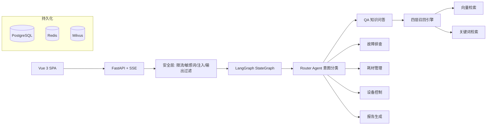

# Smart QA Agent — 基于 LangGraph 的多 Agent 智能问答系统

> 智能家居客服场景的多 Agent 问答系统，支持知识问答、故障排查、耗材管理、设备控制、报告生成五大业务场景。
>
> 后端 FastAPI + LangGraph + Milvus + PostgreSQL，前端 Vue 3 + Tailwind CSS。

## 架构



## 五大业务场景

| 场景 | 示例 | 核心流程 |
|------|------|---------|
| 📖 知识问答 | "扫地机卡在门槛怎么办？" | 语义缓存 → 四层召回 → 引用标注 → 反思优化 |
| 🔧 故障排查 | "错误码E05" | 错误码匹配 / 决策树引导 → 多轮对话 → 3轮未果转人工 |
| 🧹 耗材管理 | "边刷该换了" | 设备识别 → 兼容表 → 推荐 → HITL 确认 → 下单 |
| 🎮 设备控制 | "开始清扫" | 命令识别 → DeviceManager → 模拟器/真实IoT |
| 📊 报告生成 | "生成使用报告" | 查询使用日志 → 聚合统计 → LLM 优化建议 |

## 技术栈

| 层            | 技术                                                 |
|--------------|----------------------------------------------------|
| **后端**       | FastAPI + Uvicorn                                  |
| **Agent 编排** | LangGraph StateGraph + MemorySaver + PostgresStore |
| **向量检索**     | Milvus + BAAI/bge-small-zh-v1.5                    |
| **关键词检索**    | BM25（自实现倒排索引）                                      |
| **数据库**      | PostgreSQL (asyncpg + SQLAlchemy 2.0)              |
| **缓存**       | Redis（语义缓存 + 限流计数）                                 |
| **重排序**      | BGE-Reranker-v2-m3 / 启发式降级                         |
| **安全**       | AC 自动机 + Prompt 注入检测 + PII 输出脱敏                    |
 -            | **可观测**                                            | OpenTelemetry + SigNoz（自托管）/ Prometheus |
| **前端**       | Vue 3 + Vite + Tailwind CSS                        |
| **包管理**      | uv                                                 |
| **评测**       | 18 条测试用例 + LLM-as-Judge                            |

## 快速开始

### 前置条件

- Python ≥ 3.11
- [uv](https://docs.astral.sh/uv/)
- Docker & Docker Compose（可选，用于基础设施）

### 后端启动

```bash
# 1. 安装依赖
uv sync

# 2. 配置环境变量
cp .env.example .env
# 编辑 .env: 填入 LLM_API_KEY 等必要配置

# 3. 启动基础设施
make docker-up-infra
# 或手动: docker compose -f deploy/docker-compose.yml up -d postgres redis milvus

# 4. 初始化
uv run python -m smart_qa.scripts.init_db
uv run python -m smart_qa.scripts.init_vector_store

# 5. 启动服务 (http://localhost:8000)
make dev
# 或: uv run smart-qa --log-level debug
```

### 前端启动

```bash
cd frontend
npm install
npm run dev     # http://localhost:5173
```

### 一键启动

```bash
bash start.sh
```

## API

| 方法 | 路径 | 说明 |
|------|------|------|
| `POST` | `/api/v1/chat` | 普通对话 |
| `POST` | `/api/v1/chat/stream` | SSE 流式对话 |
| `GET` | `/api/v1/session/{id}/history` | 对话历史 |
| `POST` | `/api/v1/approve` | HITL 确认 |
| `POST` | `/api/v1/knowledge/upload` | 上传知识文档 |
| `GET` | `/api/v1/knowledge/bm25/status` | BM25 索引状态 |
| `GET` | `/health` | 健康检查 |
| `GET` | `/metrics` | Prometheus 指标 |
| `GET` | `/docs` | Swagger API 文档 |

## 常用命令

```bash
# 代码质量
make lint          # ruff 检查
make lint-fix      # 自动修复

# 测试
make test          # 75 条单元测试
make test-cov      # 含覆盖率报告

# 评测
make eval          # 跑全部 18 条测试用例（含 LLM-as-Judge）
make eval-easy     # 只跑 11 条简单用例

# 数据库
make db-init       # 初始化/迁移数据库
make vector-init   # 初始化向量知识库

# Docker
make docker-up          # 全部启动（含 web + SigNoz）
make docker-up-infra    # 仅基础设施 (postgres/redis/milvus)
make docker-build       # 构建镜像

# 可观测
make docker-up          # 启动后访问 http://localhost:3301 打开 SigNoz
# 配置 OTEL_EXPORTER_OTLP_ENDPOINT=http://signoz:4318 即可上报
```

## 相关文档

- [ARCHITECTURE.md](docs/ARCHITECTURE.md) — 系统架构详细设计
- [.env.example](.env.example) — 环境变量配置模板
- [`docs/`](docs/) — 更多技术文档（技术选型对比等）

## 许可

MIT License
