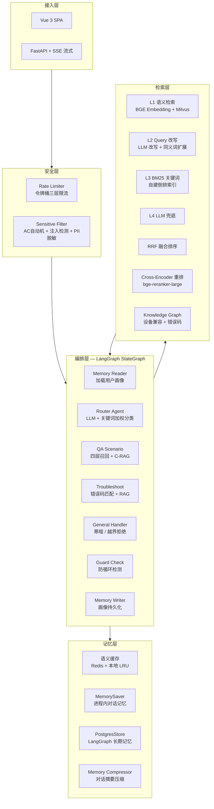

# 技术架构

## 一、系统架构



## 二、请求流程

```
POST /api/v1/chat
  │
  ├── check_rate_limit(user_id)       # 令牌桶限流
  ├── check_security(message)         # 敏感词 + Prompt 注入检测
  │
  ├── graph.ainvoke(state)
  │     │
  │     ├── memory_reader             # 加载用户画像 (PostgresStore)
  │     ├── RouterAgent.route()       # LLM 优先 + 关键词纠偏
  │     ├── Scenario.run()            # 场景执行
  │     │     ├── SemanticCache.get() # 语义缓存命中 → 直接返回
  │     │     ├── MultiLayerRetriever # 四层召回 (语义→改写→BM25→LLM)
  │     │     ├── RRF 融合            # 并行检索结果去重排序
  │     │     ├── Reranker.rerank()   # Cross-Encoder 精排
  │     │     ├── KnowledgeGraph      # GraphRAG 上下文增强
  │     │     ├── CitationTracker     # 句子级引用标注
  │     │     ├── HallucinationGuard  # 幻觉风险分级
  │     │     ├── ReflectionAgent     # 自我反思 (最多 3 轮)
  │     │     └── SemanticCache.set() # 写入缓存
  │     ├── LoopDetector.check()      # 四重防循环
  │     └── memory_writer             # 持久化用户画像
  │
  └── security.check_output(answer)   # PII 输出脱敏
```

## 三、模块清单

| 模块 | 路径 | 说明 |
|------|------|------|
| **编排层** | | |
| StateGraph | `agent/graph.py` | 7 节点，条件路由，循环边 |
| Router Agent | `agent/agents/router_agent.py` | LLM + 加权关键词，5 阶段 pipeline |
| RAG Agent | `agent/agents/rag_agent.py` | C-RAG + 幻觉防护 + 自反思 |
| Reflection | `agent/agents/reflection.py` | 规则检查 + LLM 自查 + 事实校验 |
| Loop Detector | `agent/guards/loop_detector.py` | 步数/超时/重复工具/语义循环 |
| Persona | `agent/persona.py` | 统一人设 + 三层响应 (寒暄/业务/越界) |
| **场景层** | | |
| QA Scenario | `scenarios/qa_scenario.py` | 语义缓存 + RAG 检索 + 写回缓存 |
| Troubleshoot | `scenarios/troubleshoot_scenario.py` | E01-E08 错误码精确匹配 + RAG 兜底 |
| **检索层** | | |
| 四层召回 | `rag/retrieval.py` | MultiLayerRetriever: 语义→改写→BM25→LLM |
| Reranker | `rag/reranker.py` | Cross-Encoder / LLM / heuristic 三后端, 归一化+混合打分 |
| Chunking | `rag/chunking.py` | 递归/Markdown/语义/表格 四种分片策略 |
| Citation | `rag/citation.py` | 句子级引用标注 + 幻觉风险分级 |
| **知识层** | | |
| BM25 | `knowledge/bm25.py` | 自建倒排索引 + pickle 持久化 + 预计算 doc_len |
| Embedding | `knowledge/vector_store.py` | 单例 + 可插拔后端 |
| Embedding 后端 | `knowledge/embedding_backends.py` | Local / Ollama / API / Fallback |
| 文档解析 | `knowledge/document_parser.py` | PyMuPDF + 内置 Markdown/TXT |
| 知识图谱 | `knowledge/knowledge_graph.py` | 设备兼容 + 错误码树 + GraphRAG |
| **记忆层** | | |
| 语义缓存 | `memory/cache.py` | Redis + 本地 LRU |
| 记忆压缩 | `memory/short_term.py` | 对话摘要 + 窗口保留 |
| 对话持久化 | `memory/conversation_store.py` | PostgreSQL |
| **基础设施** | | |
| DI 容器 | `di.py` | register / register_factory / get |
| 配置 | `config.py` | pydantic-settings, 30+ 可调参数 |
| 异常 | `exceptions.py` | 4 层异常体系 (11 类型) |

## 四、设计决策

| 决策 | 理由 |
|------|------|
| **LLM 优先 + 关键词纠偏** | LLM 语义理解强但有时过于自信, 关键词规则经人工调优更可靠 |
| **四层降级而非单层** | Embedding 对领域术语敏感, BM25 反而更准, 互补提升召回率 |
| **RRF 融合而非分数加权** | 向量余弦与 BM25 分数不可直接比较, RRF 只关心排名位置 |
| **Cross-Encoder 精排** | 从 20 篇候选细筛到 5 篇, 模型分 70% + 关键词分 30% 混合 |
| **L4 兜底标注来源** | 无检索文档时告知用户答案来自通用知识, 防止"假装有依据" |
| **BM25 预计算 doc_len** | 评分循环避免重复分词, 42ms → 0.22ms (190x) |
