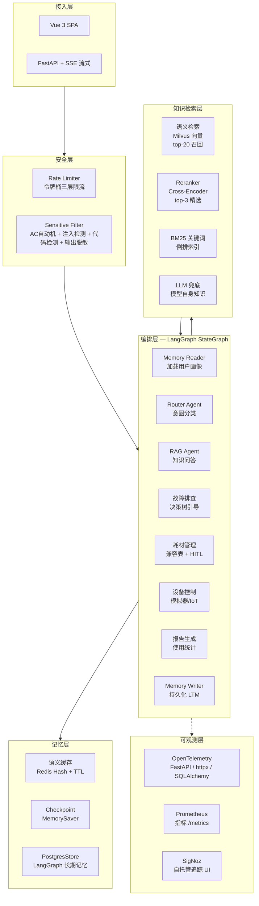

# 智能问答 Agent 系统 — 技术架构

## 一、系统架构



## 二、核心流程

```
POST /api/v1/chat
  │
  ├── check_rate_limit(user_id)          # 1. 令牌桶限流
  ├── check_security(message)            # 2. 敏感词 + Prompt注入 + 代码注入
  │
  ├── graph.ainvoke(state)
  │     │
  │     ├── memory_reader                # 加载用户画像 (PostgresStore)
  │     ├── RouterAgent.route()          # 意图分类
  │     ├── Scenario.run()               # 场景执行
  │     │     ├── SemanticCache.get()    # L1 缓存命中
  │     │     ├── MultiLayerRetriever    # 四层召回 + Reranker
  │     │     ├── LLM 生成回答
  │     │     └── SemanticCache.set()    # 写入缓存
  │     ├── LoopDetector.check()         # 3. 三重防循环
  │     └── memory_writer                # 持久化 LTM (PostgresStore)
  │
  └── security.check_output(answer)      # 4. PII 输出脱敏
```

## 三、模块清单

| 模块 | 路径 | 状态 |
|------|------|------|
| Router Agent | `agent/agents/router_agent.py` | ✅ 6意图分类 (LLM+关键词) |
| QA 场景 | `scenarios/qa_scenario.py` | ✅ 语义缓存 + RAG |
| 故障排查 | `scenarios/troubleshoot_scenario.py` | ✅ 决策树 + 多轮 |
| 耗材管理 | `scenarios/consumables_scenario.py` | ✅ 推荐 + HITL + 下单 |
| 设备控制 | `scenarios/device_control_scenario.py` | ✅ 6种命令 (设备模拟器) |
| 报告生成 | `scenarios/report_scenario.py` | ✅ 月度/周/异常/耗材 |
| 四层召回 | `rag/retrieval.py` | ✅ 语义→改写→BM25→LLM |
| Reranker | `rag/reranker.py` | ✅ Cross-Encoder / 启发式降级 |
| BM25 索引 | `knowledge/bm25.py` | ✅ 增量更新 + 持久化 |
| 语义缓存 | `memory/cache.py` | ✅ Redis Hash + TTL |
| 长期记忆 | `agent/graph.py` (PostgresStore) | ✅ 用户画像持久化 |
| 多轮对话 | `api/routes/chat.py` | ✅ MemorySaver + PG |
| 三重防循环 | `agent/guards/loop_detector.py` | ✅ 硬上限 + 运行时 + 强制 |
| 安全四道防线 | `security/` | ✅ 敏感词/注入/代码/PII |
| 三层限流 | `security/` | ✅ 全局 + 用户 + token |
| E2E 评测 | `evaluation/runner.py` | ✅ 18用例 + LLM-Judge |
| 可观测 | `observability/` | ✅ OTel + SigNoz / Prometheus |

## 四、技术选型

| 模块 | 选型 | 备选 |
|------|------|------|
| Agent 框架 | LangGraph StateGraph | CrewAI |
| 向量库 | Milvus | Qdrant / Chroma |
| 关系库 | PostgreSQL | — |
| 缓存 | Redis | local dict |
| 重排序 | BGE-Reranker-v2-m3 | 启发式降级 |
| 可观测 | OTel + SigNoz / Prometheus | Logfire / Grafana |
| 前端 | Vue 3 + Vite | Streamlit |
