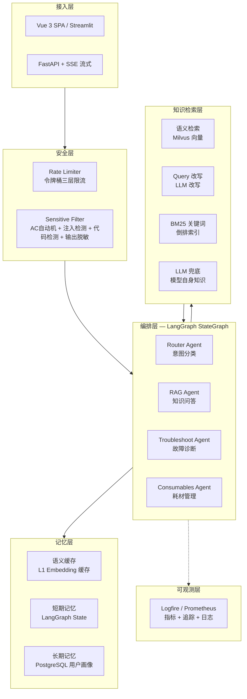

# 智能问答 Agent 系统 — 技术设计文档

> 本文档描述系统的总体架构、核心能力与技术选型，覆盖从需求到运维的全生命周期。
> 实际代码尚未完全覆盖本设计，详见 [TODO.md](./TODO.md) 跟踪未实现功能。

---

## 一、系统架构



---

## 二、核心流程

```
POST /api/v1/chat
  │
  ▼
check_rate_limit(user_id)          # 1. 令牌桶限流
check_security(message)            # 2. 敏感词 + Prompt注入 + 代码注入检测
  │
  ▼
graph.ainvoke(state)               # 3. LangGraph 编排
  │
  ├── RouterAgent.route()          # 意图分类 → qa/troubleshoot/consumables/general
  │
  ├── Scenario.run()               # 场景执行
  │     ├── SemanticCache.get()    # L1 缓存命中（未实现）
  │     ├── MultiLayerRetriever    # 四层召回
  │     ├── LLM 生成回答
  │     └── SemanticCache.set()    # 写入缓存（未实现）
  │
  └── LoopDetector.check()         # 4. 三重防循环检测
        └── decide → continue / stop / done
  │
  ▼
check_output(answer)               # 5. PII 输出脱敏
```

---

## 三、模块职责

| 模块               | 文件                                           | 状态    | 功能                                            |
|------------------|----------------------------------------------|-------|-----------------------------------------------|
| **Router Agent** | `src/agent/agents/router_agent.py`           | ✅ 实现  | LLM 意图分类: qa/troubleshoot/consumables/general |
| **QA 场景**        | `src/app/scenarios/qa_scenario.py`           | ✅ 实现  | 知识问答，RAG 检索 + LLM 生成                          |
| **故障诊断**         | `src/app/scenarios/troubleshoot_scenario.py` | ✅ 实现  | 引导式排查 + 错误码匹配                                 |
| **耗材管理**         | `src/app/scenarios/consumables_scenario.py`  | ✅ 实现  | 耗材兼容查询 + 更换建议                                 |
| **四层召回**         | `src/rag/retrieval.py`                       | ✅ 实现  | 语义→改写→BM25→LLM                                |
| **三重防循环**        | `src/agent/guards/loop_detector.py`          | ✅ 实现  | 步数限制 + 重复检测 + 语义循环                            |
| **安全四道防线**       | `src/security/`                              | ✅ 实现  | AC自动机 + 注入 + 代码 + PII脱敏                       |
| **三层限流**         | `src/security/rate_limiter.py`               | ✅ 实现  | 全局 + 用户 + Token预算                             |
| **语言缓存**         | —                                            | ❌ 未实现 | L1 Embedding 语义缓存                             |
| **引用标注**         | —                                            | ❌ 未实现 | 生成回答标注知识来源                                    |
| **幻觉检测**         | —                                            | ❌ 未实现 | LLM-as-Judge 事实一致性检查                          |
| **报告生成**         | —                                            | ❌ 未实现 | 月度/异常使用报告                                     |
| **设备控制**         | —                                            | ❌ 未实现 | MCP 工具控制扫地机                                   |
| **人类审批**         | —                                            | ❌ 未实现 | 关键操作 HITL 确认                                  |
| **E2E 评测**       | `src/evaluation/`                            | ✅ 实现  | 55 个测试用例 + LLM-as-Judge                       |
| **可观测**          | `src/observability/`                         | 🟡 部分 | Prometheus 指标 + 日志，缺 LangSmith 追踪             |

---

## 四、技术选型

| 模块           | 选型            | 选型理由                  | 备选方案                        |
|--------------|---------------|-----------------------|-----------------------------|
| **Agent 框架** | LangGraph     | 状态管理、持久化、生产就绪         | CrewAI（控制力不足）               |
| **LLM**      | OpenAI 兼容 API | 可切换 DeepSeek/Qwen/GPT | 单一厂商绑定                      |
| **向量库**      | Milvus        | 存算分离、百亿级              | Qdrant（更轻量） / Chroma（扩展性不足） |
| **关系库**      | PostgreSQL    | PGVector/JSONB/稳定     | MySQL（向量弱）                  |
| **缓存**       | Redis         | 高性能 TTL/LRU           | 本地 dict（重启丢失）               |
| **前端**       | Vue 3 + Vite  | 生产级、组件生态              | Streamlit（快速可弃用）            |

---

## 五、当前局限

| 问题               | 说明                                   | 影响           |
|------------------|--------------------------------------|--------------|
| 无语义缓存            | 相同问题每次都走完整链路                         | 响应慢、Token 浪费 |
| 无引用来源            | Agent 回答不标注知识来源                      | 用户无法验证答案可信度  |
| 无幻觉检测            | 不验证 LLM 输出与检索结果的一致性                  | 可能给出错误信息     |
| 流式缺安全            | `/chat/stream` 端点没调 `check_security` | 安全隐患         |
| `done` 跳过了 guard | Router 返回 `"done"` 时直接 `END`         | 防循环失效        |
| 无记忆写入节点          | 只有 Checkpoint 快照，无 LTM 结构化写入         | 跨会话记忆不生效     |
