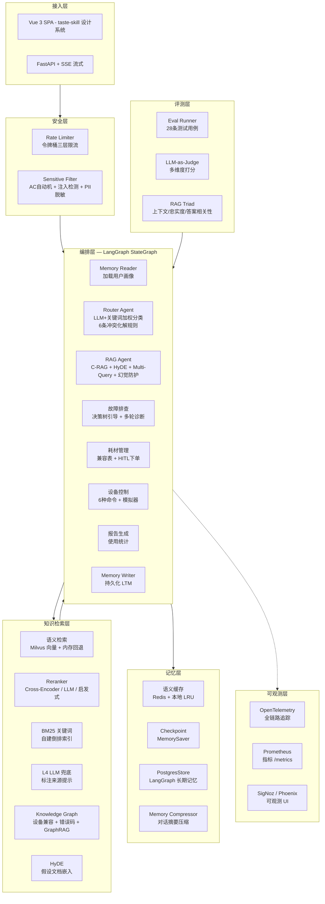

# 智能问答 Agent 系统 — 技术架构

## 一、系统架构



## 二、核心流程

```
POST /api/v1/chat
  │
  ├── check_rate_limit(user_id)          # 令牌桶限流
  ├── check_security(message)            # 敏感词 + Prompt注入检测
  │
  ├── graph.ainvoke(state)
  │     │
  │     ├── memory_reader                # 加载用户画像 (PostgresStore / InMemoryStore)
  │     ├── RouterAgent.route()          # LLM优先 + 关键词加权纠偏
  │     ├── Scenario.run()               # 场景执行
  │     │     ├── SemanticCache.get()    # 语义缓存命中 → 直接返回
  │     │     ├── HyDE.generate()        # 假设文档嵌入 (短查询跳过)
  │     │     ├── Multi-Query 分解       # 复杂查询拆分 (≤15字跳过)
  │     │     ├── MultiLayerRetriever    # 并行/级联四层召回
  │     │     ├── Reranker.rerank()      # Cross-Encoder 精选
  │     │     ├── KnowledgeGraph.augment() # GraphRAG 上下文增强
  │     │     ├── CitationTracker        # 句子级引用标注
  │     │     ├── HallucinationGuard     # 幻觉风险分级拦截
  │     │     ├── ReflectionAgent        # 自我反思 (最多3轮)
  │     │     └── SemanticCache.set()    # 写入缓存
  │     ├── LoopDetector.check()         # 三重防循环
  │     └── memory_writer                # 持久化 LTM
  │
  └── security.check_output(answer)      # PII 输出脱敏
```

## 三、模块清单

| 模块 | 路径 | 状态 |
|------|------|------|
| **编排层** | | |
| Router Agent | `agent/agents/router_agent.py` | ✅ LLM+加权关键词, 6条冲突化解规则 |
| RAG Agent | `agent/agents/rag_agent.py` | ✅ C-RAG + HyDE + 幻觉防护 + 自反思 |
| Loop Detector | `agent/guards/loop_detector.py` | ✅ 硬上限 + 运行时检测 + 强制终止 |
| Persona | `agent/persona.py` | ✅ 统一人设 + 越界检测 |
| **场景层** | | |
| QA 场景 | `scenarios/qa_scenario.py` | ✅ 语义缓存 + RAG |
| 故障排查 | `scenarios/troubleshoot_scenario.py` | ✅ 决策树 + 多轮诊断 |
| 耗材管理 | `scenarios/consumables_scenario.py` | ✅ 推荐 + HITL + 下单 |
| 设备控制 | `scenarios/device_control_scenario.py` | ✅ 6种命令 |
| 报告生成 | `scenarios/report_scenario.py` | ✅ 月度/周/异常/耗材 |
| SQL 查询 | `scenarios/sql_scenario.py` | ✅ Text2SQL |
| **检索层** | | |
| 四层召回 | `rag/retrieval.py` | ✅ 语义→改写→BM25→LLM, RRF融合 |
| 检索工具 | `rag/retrieval_utils.py` | ✅ 停用词 + BM25加载 + 知识收集 |
| Reranker | `rag/reranker.py` | ✅ Cross-Encoder / LLM / 启发式降级 |
| Chunking | `rag/chunking.py` | ✅ 递归/Markdown/语义/表格 四种策略 |
| Citation | `rag/citation.py` | ✅ 句子级引用 + 幻觉风险分级 |
| HyDE | `rag/hyde.py` | ✅ 假设文档嵌入, 10s超时保护 |
| **知识层** | | |
| BM25 | `knowledge/bm25.py` | ✅ 自建倒排索引 + pickle持久化 |
| Embedding | `knowledge/vector_store.py` | ✅ 单例 + 自动批处理 |
| 嵌入后端 | `knowledge/embedding_backends.py` | ✅ Local / Ollama / API / Fallback |
| 文档解析 | `knowledge/document_parser.py` | ✅ Unstructured / PyMuPDF / 内置 |
| 知识图谱 | `knowledge/knowledge_graph.py` | ✅ 设备兼容 + 错误码 + GraphRAG |
| **记忆层** | | |
| 语义缓存 | `memory/cache.py` | ✅ Redis + 本地LRU |
| 记忆压缩 | `memory/short_term.py` | ✅ 对话摘要 + 窗口保留 |
| 对话持久化 | `memory/conversation_store.py` | ✅ PG 7天TTL |
| **基础设施** | | |
| DI 容器 | `di.py` | ✅ 统一依赖管理 |
| 依赖访问 | `deps.py` | ✅ 容器代理 + 回退构造 |
| 配置 | `config.py` | ✅ 18个新增调优参数 |
| 异常分层 | `exceptions.py` | ✅ 4层异常体系 |
| **评测层** | | |
| Eval Runner | `evaluation/runner.py` | ✅ 28用例 + CLI + LLM-Judge |
| RAG Triad | `evaluation/metrics.py` | ✅ 上下文/忠实度/答案 三元评分 |
| **前端** | | |
| ChatView | `frontend/src/views/ChatView.vue` | ✅ taste-skill 设计, SSE流式 |
| 组件库 | `frontend/src/components/` | 8个组件 (含新增 Skeleton/ErrorBanner) |
| 设计系统 | `frontend/tailwind.config.js` | ✅ teal强调色 + 暖中性底 + 暗色模式 |

## 四、技术选型

| 模块 | 选型 | 说明 |
|------|------|------|
| Agent 框架 | LangGraph StateGraph | 9节点, 条件边, MemorySaver |
| 向量库 | Milvus 2.5.6 | 123 chunks, standalone模式 |
| 关系库 | PostgreSQL 17 | ORM + Alembic 迁移 |
| 缓存 | Redis 7 | 语义缓存 + 限流 |
| 重排序 | BGE-Reranker-v2-m3 | Cross-Encoder, 本地部署 |
| 嵌入 | DashScope text-embedding-v4 | API优先, 本地回退 |
| 可观测 | OTel + SigNoz / Phoenix | 全链路追踪 |
| 前端 | Vue 3 + Vite + Tailwind | taste-skill 设计系统 |
| 包管理 | uv | 清华大学镜像加速 |

## 五、设计决策

| 决策 | 理由 |
|------|------|
| **LLM优先 + 关键词纠偏** | LLM语义理解强但有时过于自信, 关键词规则经人工调优后更可靠 |
| **四层降级而非单层** | Embedding对领域术语敏感, BM25反而更准, 互补提升召回率 |
| **RRF融合而非分数归一化** | 向量余弦与BM25分数不可直接比较, RRF绕过归一化问题 |
| **短查询跳过HyDE/分解** | ≤8字查询的embedding已足够精确, 节省10-30s LLM调用 |
| **L4兜底标注来源** | 无检索文档时告知用户答案来自通用知识, 防止"假装有依据" |
| **忠实度None而非0.0** | 无检索文档的查询不参与评分, 避免污染平均值 |
| **taste-skill设计系统** | 反AI俗套: teal代替蓝紫, 毛玻璃气泡, SVG图标, 暖中性底色 |
